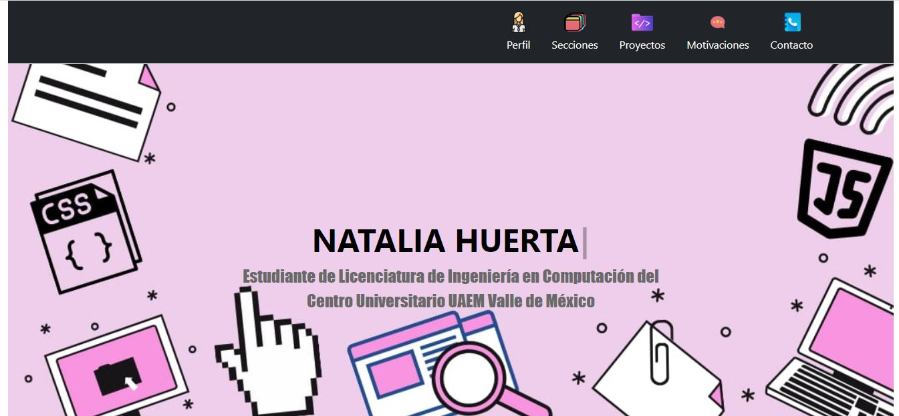

# ¡Bienvenidos a mi proyecto realizado en Tecnolochicas PRO Summer Camp!

Me emociona presentarles esta página web que he creado con mucho entusiasmo. Se trata de un sitio responsivo, lo que significa que se adapta perfectamente a cualquier tamaño de pantalla, permitiendo una experiencia de usuario fluida y agradable.

****
## Portafolio Responsivo con Bootstrap 5

El propósito del sitio web es mostrar el Portafolio de proyectos de un(a) desarrollador(a) y su experiencia.

Para hacer que el sitio sea aún más dinámico e interactivo, se ha implementado. animaciones utilizando JavaScript, que sin duda agregarán un toque especial a la navegación y experiencia de los visitantes.

## Consulta
Puedes consultar mi portafolio en el siguiente link: 

## Evidencia
 1. Primera parte de la página web: 
 
 2. Secciones:
 
 3. Proyectos:
 
 4. Motivaciones:
 
 5. Contacto:
 

## Tecnologías

Las tecnologías utilizadas en la creación de este proyecto son:
- HTML5 
- CSS3
- JavaScript 
- Bootstrap 5 

***Con estas poderosas herramientas, he logrado diseñar una interfaz moderna y elegante.***

Además, no podrían faltar las atractivas tipografías de ***Google Fonts***, que añaden estilo y legibilidad al contenido del sitio.

## Idioma

Es importante mencionar que aunque el texto de la página web está en **español** para una mejor comunicación con todos ustedes, las clases relacionadas con Bootstrap se ***incluyen en inglés***.

****
Espero que disfruten explorando mi portafolio y conozcan más sobre mi pasión por la programación. 
¡Gracias por visitar mi sitio web!

## Contacto 

*Desarrollado en Tecnolochicas PRO Summer Camp.*

Elaborado por: **Natalia Huerta**
